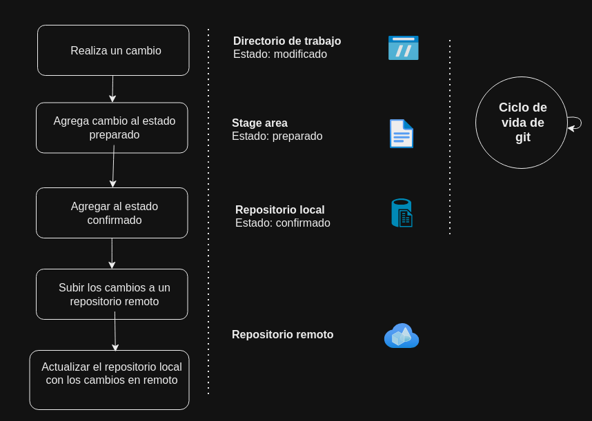
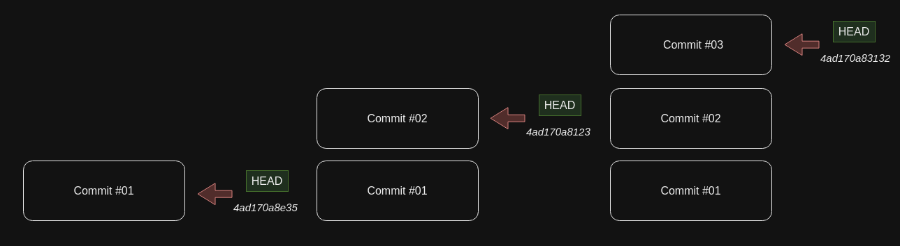

# **Git and Github conceptos básicos**

# **Índice**

1. Conceptos básicos

2. Comando en repositorio local

3. Comandos en repositorio remoto (Github)

4. Buenas prácticas


## 1. Conceptos básicos

### ¿Qué es git?

Es un **controlador de versiones**, es decir una herramienta que permite administrar las versiones de un proyecto a lo largo del tiempo. 
Puede alojar una copia completa del proyecto en una máquina local(repositorio local) y subirla y actualizarla a uno o más repositorios remotos.

### Repositorios

Es una carpeta que contiene los carpetas y archivos del proyecto, así como las versiones de este.

### Ciclo de vida de git

El ciclo de vida de git esta constituido por los cambios de estado por los que pasa un cambio.



### Head

Es un apuntador que reconoce en que parte del historial de versiones te encuentras. Se posiciona generalmente en el último commit y apunta al hash de este.



### Ramas

Versiones del directorio principal. Tienen una gran importancia ya que brindan una abstracción del espacio de trabajo del desarrollador para que este pueda agregar nuevas características, las cuales pueden ser integradas (merge) a la rama main.

### Fusión de ramas y conflictos

La función de ramas es un método de git que permite unir dos ramas. La fusión entre dos ramas se realiza con la finalidad de añadir contenido desarrollado en la rama a fusionar con la rama principal. Es muy común realizar fusiones desde la rama principal, sin embargo, es posible realizar esta acción desde cualquier rama.

Por otra parte los conflictos al fusionar surgen cuando las ramas a fusionar han realizado modificaciones en las mismas líneas de un archivo, por lo que git entra en conflicto al intentar decidir que cambio conservar.

## 2. Comando en repositorio local

### Listar comandos en consola

``` sh
git --help
```

### Inicializar un repositorio

Crea el directorio que guardará las versiones

``` sh
git init <nameDirectory>
```

### Valores de configuración 

Git config permite configurar los valores de git necesarios para principalmente identificar al usuario que realiza el commit tanto el servidor local como remoto

Existen tres tipos de ambientes en los que se puede agregar configuraciones: ***global, local y system***

- Global: configuración global para todos los repositorios creados por un determinado usuario
- Local: configuración para un determinado repositorio
- System: configuración global para todos los usuarios.

Mostrar valores de configuración 

``` sh
# Según el ambiente
git config global --list
git config local --list
git config system --list

# Todos los ambientes
git config --list --show-scope
```

Establecer valores principales para identificar un usuario

``` sh
git config --global user.name "username" 
git config --global user.email "email" 
```

### Remover archivos y directorios del directorio de trabajo (estado modificado)

Opciones: 
- n: muestra lo que ocurriría al ejecutarse, **no realiza cambios**.
- f: fuerza el borrado de las modificaciones en archivos
- d: borra las modificaciones en directorios
- i: espera una confirmación para cada archivo que será afectado

``` sh
# Afecta a todos los archivos en estado modificado
git clean -n

# Afecta al elemento especifico
git clean <nameFileOrDirectory> -n
```

### Agregar al stage area (estado preparado)

> [!NOTE]
> Es posible agregar todos los cambios de la raiz ".", archivos "nameFile.extension" o archivos con una extensión especifica "*.nameExtension"  

``` sh
git add .
```

Deshacer los cambios del stage area

``` sh
git reset <fileName>
```

### Ver el estado de las modificaciones

La bandera -s, es opcional, muestra un resultado resumido

``` sh
git status -s
```
Ejemplo
``` sh
# M: En estado modificado 
# A: En estado preparado
# ??: Primera vez en estado modificado 

❯ git status -s
 M  README.md
 A  cleanN.txt
 ?? image.png
```

### Realizar un commit (estado confirmado)
``` sh

git commit -m "Message commit"

# Pasar de modificado a preparado 
```
git commit -am "Message commit"

Modificar el último commit

``` sh
# Modificar mensaje
git commit --amend -m <message>

# Agregar nuevos cambios al commit
# *Paso1: Agregar modificaciones al staged
git commit --amend -m <message>
```

Deshacer el último commit

``` sh
# Convervar cambios
git reset --soft HEAD~1 

# Descartar cambios
git reset --hard HEAD~1 

# Obtener ubicación del HEAD
git rev-parse HEAD
```

### Archicos ingnorados (gitignore)

``` sh
# Agregar elementos a gitignore de forma global
# Crear archivo: ~/.gitignore_global
# Actualizar configuración de core.excludefile
git config --global core.excludesfile ~/.gitignore_global
```

Quitar archivos después de un commit

> [!NOTE]
> Este método no borra el cambio del historial de versiones 

Eliminar elemento sin convervarlo

``` sh
# Manual
rm nameFile
git add nameFile
git commit -m "message remove nameFile"

# Usando git
git rm nameFile
git commit -m "message remove nameFile"
```

Eliminar elemento conservándolo (pasandolo a un estado de modificado)

``` sh
# Ver que cambios se realizarán
git rm --dry-run --cached <nameFile>

# Eliminar directorio
git rm -r --cached <nameDir>
```

### Manejo de ramas

Ver ramas

``` sh
# Ver la rama actual
git branch --show-current

# Ordenar ramas por fecha del último commit
git branch --sort = -committerdate
```

Crear ramas

``` sh
git branch <nameBranch>
git switch -c <nameBranch>
```

Cambiar de rama

``` sh
git switch <nameBranch>
```

Fusionar ramas (**merge**)

> [!IMPORTANT]
> El comando une el contenido de la rama desde la rama en la que se ejecuta el comando. Generalmente se usa desde la rama main

``` sh
git merge <nameOtherBranch>  

# Agregar comentario al hacer un commit
git merge --edit 
```

Eliminar ramas

``` sh
git branch -d <nameBranch>

# Eliminar ramas fusionadas desde el repositorio remoto
git remote prune origin --dry-run 
git remote prune origin
```

